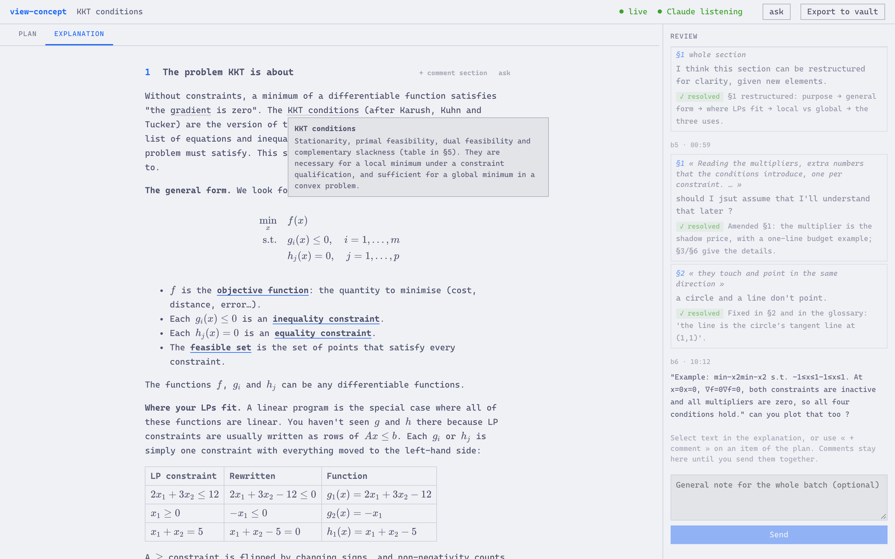
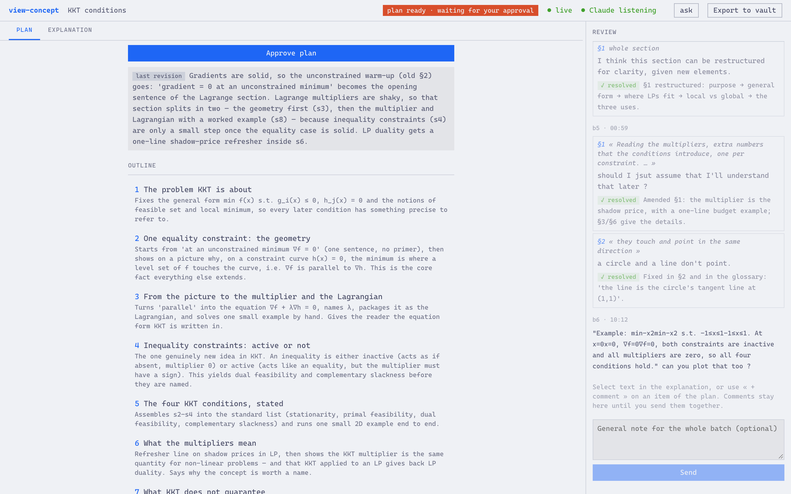
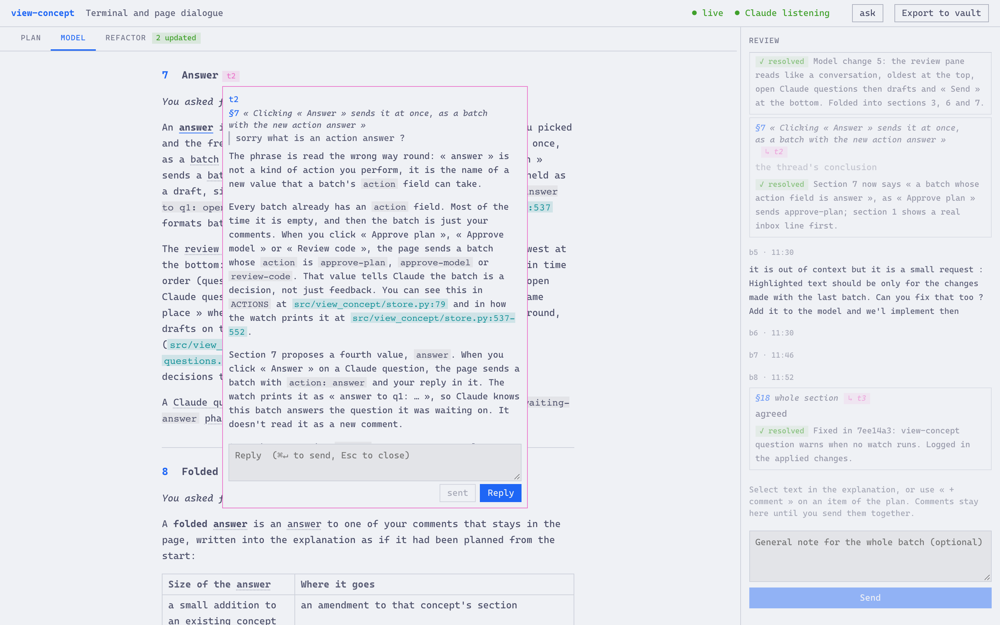
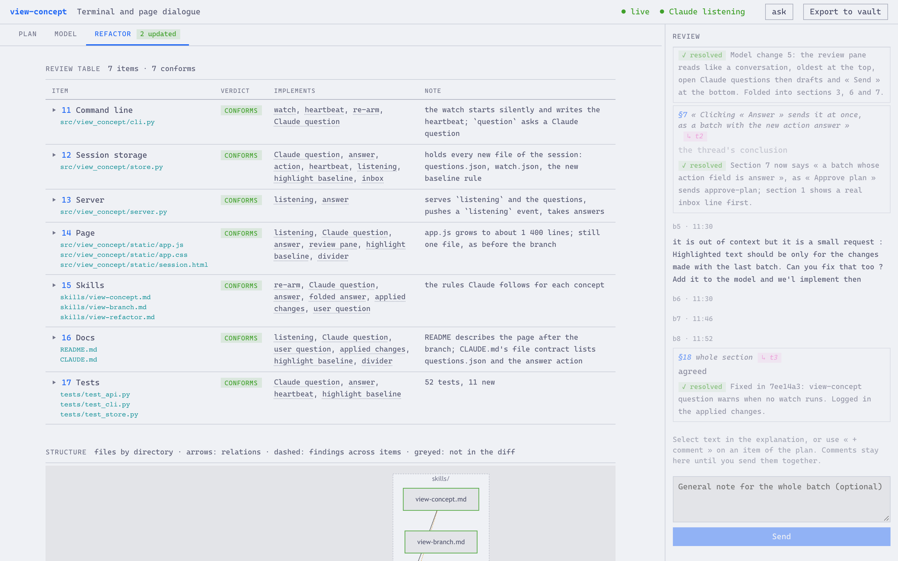

# view-concept

view-concept is a local web page where Claude Code writes explanations and code reviews, and where you read and comment on them. Each tool is a Claude Code **skill** (a Markdown file of instructions Claude Code loads when you type its name): `/view-concept`, `/view-branch`, `/view-refactor`.

Claude writes plain files; the **page** renders them in your browser as they are written. You select passages, comment on them, and « Send » posts all your comments at once, as one **comment batch**, to the Claude Code session, which revises the text. One explanation or review, with its files and comments, is a **session**.



## Why a page

In the terminal, a long explanation scrolls away, you cannot point at the sentence you did not understand, and each revision is a new copy to compare with the old one. In the page, the text stays put, comments are anchored to their passage, and a rewritten section highlights what changed.

The page is built around **explain-concept**, a skill that holds an explanation method. Two of its rules show in the page:

- **The plan comes before the prose.** The **plan** is the outline plus the **lexicon**, the list of every term the explanation uses, with the section that introduces it and its definition. You approve the plan before any paragraph is written.
- **Every term is defined before it is used.** Hovering a lexicon term shows its definition, and a final **vocabulary audit** flags terms that slipped through undefined.

## What a session looks like

You type `/view-concept explain KKT conditions`. Claude asks one or two questions in the terminal about your level and goal, then opens the page.

1. **Plan.** Claude writes the outline and the lexicon in the Plan tab. You correct it or click « Approve plan ».
2. **Prose.** Claude writes the sections one by one; the page re-renders as each one lands.
3. **Comments.** Select a passage, « + comment », repeat, then « Send ». Claude edits the sections, replies to each comment, and the words it changed stay highlighted until your next batch.
4. **Side threads.** To discuss a passage before asking for a change, select it and click « ask ». A **side thread** is a separate, read-only conversation forked from the session, so it knows the discussion so far; the session never sees it.





The page and the terminal talk through the session's files: the page appends each batch to an inbox file, and `view-concept watch`, running inside the Claude Code session, hands each new batch to Claude.

## Three skills

| Skill | Use it to |
|---|---|
| `/view-concept` | understand a concept, as described above |
| `/view-branch` | review a branch you are building, concepts first |
| `/view-refactor` | decide what stays in quickly written code, then restructure it |

A **branch review** (`/view-branch`) first writes the concepts the branch introduces, with their rules; you correct them and approve. Claude then fixes the code to match, and the Refactor tab lists each changed file with its **verdict** (the decision recorded for that item) and a chart of how the files relate. « Create PR » opens the pull request.



`/view-refactor` works the same way on existing code: each item gets a triage verdict (`keep`, `move`, `split`, `merge`, `throw`, `separate-pr`), then Claude applies it on the current branch or splits it into PRs reviewed with `/view-branch`.

## Install

You need [Claude Code](https://claude.com/claude-code) and [uv](https://docs.astral.sh/uv/). No API key: everything, side threads included, runs on your Claude Code subscription.

```bash
git clone https://github.com/Vaillus/view-concept.git ~/Documents/code/view-concept
uv tool install -e ~/Documents/code/view-concept          # the view-concept command
mkdir -p ~/.claude/commands
ln -s ~/Documents/code/view-concept/skills/*.md ~/.claude/commands/   # the four skills
```

The links mean a `git pull` also updates the skills. `/view-concept` expects `explain-concept` at `~/.claude/commands/explain-concept.md`; if you already have a file there, `ln` won't overwrite it.

Start a new Claude Code session and type `/view-concept` to check.

## Further reading

- [`docs/reference.md`](docs/reference.md): commands, session files, page controls, configuration.
- [`docs/related-work.md`](docs/related-work.md): similar tools and what this one adds.
- Development: `uv sync && uv run pytest`, then `uv run ruff check --fix . && uv run ruff format . && uv run ty check .`. After changing the server, run `view-concept stop`.
